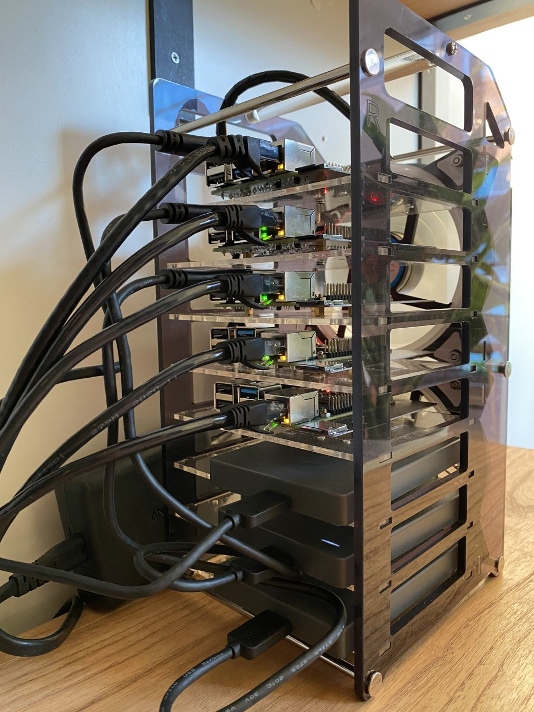
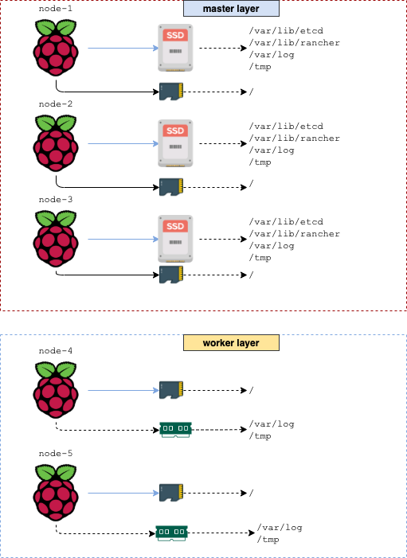

# ansible-k3s-raspberry

Build a Raspberry Pi K3s cluster using Ansible.
It works under `Ubuntu 21.04`, and probably some other recent Ubuntu/Debian versions.

This Role runs some hardening for the SSH service, creates the CA certificate and node certificates, installs `etcd` and creates the k3s cluster.

```shell
$: kubectl get nodes -o wide
NAME                   STATUS   ROLES    AGE   VERSION         INTERNAL-IP     EXTERNAL-IP   OS-IMAGE       KERNEL-VERSION      CONTAINER-RUNTIME
node-1.k3s.tty0.guru   Ready    master   68m   v1.19.13+k3s1   192.168.5.201   <none>        Ubuntu 21.04   5.11.0-1015-raspi   containerd://1.4.8-k3s1
node-2.k3s.tty0.guru   Ready    master   63m   v1.19.13+k3s1   192.168.5.202   <none>        Ubuntu 21.04   5.11.0-1015-raspi   containerd://1.4.8-k3s1
node-3.k3s.tty0.guru   Ready    master   68m   v1.19.13+k3s1   192.168.5.203   <none>        Ubuntu 21.04   5.11.0-1015-raspi   containerd://1.4.8-k3s1
node-4.k3s.tty0.guru   Ready    <none>   49m   v1.19.13+k3s1   192.168.5.204   <none>        Ubuntu 21.04   5.11.0-1015-raspi   containerd://1.4.8-k3s1
node-5.k3s.tty0.guru   Ready    <none>   49m   v1.19.13+k3s1   192.168.5.205   <none>        Ubuntu 21.04   5.11.0-1015-raspi   containerd://1.4.8-k3s1
```

## Working environment

This Role is used to bootstrap my local 5 nodes Raspberry Pi Cluster under `Ubuntu 21.04`, and it isn't supposed to be working on yours without changing some of the logic.



Each of the master nodes has an SSD disk attached to it (by using the USB 3.0 interface in the Raspberry Pi), all the other workers nodes only uses the SD card and all the I/O intensive operations (like log writting, or the K3s datadir) has been moved to a `tmpfs`.



## Installation

#### Edit the inventory

Add your Public SSH to desired hosts in order to enable Ansible to login, then edit the inventory (`hosts.ini`):

```ini
[master]
node-1.k3s.tty0.guru ansible_ssh_host=192.168.5.1 target_ip=192.168.5.201/24
node-2.k3s.tty0.guru ansible_ssh_host=192.168.5.2 target_ip=192.168.5.202/24
node-3.k3s.tty0.guru ansible_ssh_host=192.168.5.3 target_ip=192.168.5.203/24

[worker]
node-4.k3s.tty0.guru ansible_ssh_host=192.168.5.4 target_ip=192.168.5.204/24
node-5.k3s.tty0.guru ansible_ssh_host=192.168.5.5 target_ip=192.168.5.205/24

[k3s_cluster:children]
master
worker
```
It has two IP addresses:
* `ansibe_ssh_host` is the IP address assigned to the host
* `target_ip` is the desired IP address for the host.

After the first execution, the `ansible_ssh_host` will be updated to the value of `taget_ip` configuring Netplan.

#### Edit the Ansible global variables file

Edit the `group_vars/all.yml` file according to your preferences.

```yaml
---
ansible_user: ubuntu
network:
  dns:
    - 192.168.5.1
    - 4.2.2.1
    - 8.8.8.8
required_pkgs:
  - golang-cfssl
extra_pkgs:
  - lm-sensors
  - tcpdump
  - sysstat
sshd:
  service_name: sshd
  service_config: /etc/ssh/sshd_config
k3s:
  data_dir: "/var/lib/rancher/k3s"
  extra_server_args: "--disable traefik,servicelb"
  extra_agent_args: ""
  version: v1.19.13+k3s1
etcd:
  cluster_token: "etcd-cluster-01"
  data_dir: "/var/lib/etcd"
  initial_ca_dir: "/etc/etcd/tls"
  election_timeout: 5000
  heartbeat_interval: 250
  CA:
    cert:
      CN: "CA"
      key:
        algo: rsa
        size: 2048
    expirity: 43800h
  client:
    cert:
      CN: "{{ inventory_hostname }}"
      key:
        algo: rsa
        size: 2048
lvm:
  pv:
    disk: /dev/sda1
    extend_size: 32MB
  vg:
    name: vg00
  lv:
    - { lv_name: "logs", lv_size: "10G", mount_point: "/var/log", perms: "0775", fs: "xfs" }
    - { lv_name: "k3s",  lv_size: "50G", mount_point: "/var/lib/rancher/k3s", perms: "0775", fs: "xfs" }
    - { lv_name: "etcd", lv_size: "30G", mount_point: "/var/lib/etcd", perms: "0700", fs: "xfs" }
    - { lv_name: "longhorn", lv_size: "300G", mount_point: "/var/lib/longhorn", perms: "0755", fs: "xfs" }
```
## Running

```shell
$: ansible-playbook site.yml -i hosts.ini --diff
```

## Contributing
Pull requests are welcome. For major changes, please open an issue first to discuss what you would like to change.

## License
[MIT](https://choosealicense.com/licenses/mit/)
